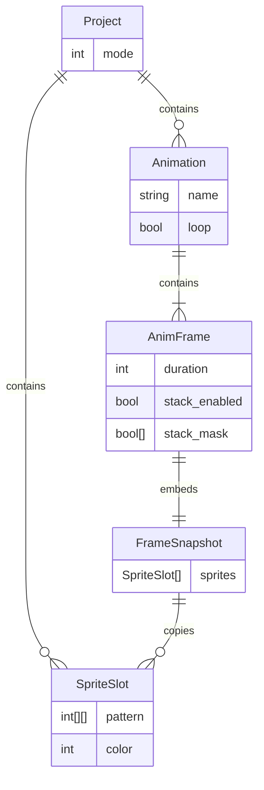
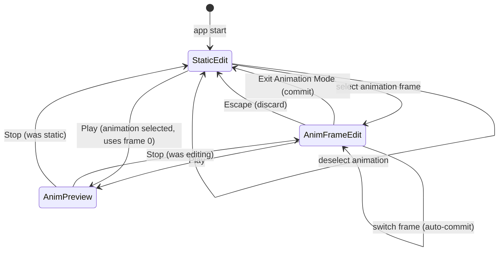

# TI-99/4A Sprite Editor — Animation Support Design

| Field | Value |
|-------|-------|
| **Author** | Sprite Editor Contributors |
| **Date** | 2026-06-16 |
| **Status** | Draft (revision 5) |
| **Target** | `src/sprite.py` (`SpriteEditor`, ~450 lines today) |

---

## Overview

The TI-99/4A Sprite Editor today supports static sprite authoring: 8×8 and 16×16 modes, dynamic sprite slots, stacked compositing via `get_stacked_sprites()`, live assembly export, and JSON project save/load. There is no concept of time — users cannot define frame sequences, preview motion, or specify how long each pose lasts in VDP screen frames.

This design adds **first-class animation support** inside the existing Tkinter monolith. Users will create named animations composed of **animation frames** (snapshots of sprite-slot state + stack configuration), set each frame's **hold duration in VDP screen frames** (~60/sec NTSC on the TMS9918), preview animations at approximately real hardware timing, and persist animations in the JSON project format with backward-compatible loading.

Stacked sprites are a first-class animation primitive: each animation frame captures which slots are stacked and the pattern/color of every slot, so composite characters (e.g., body + weapon layers) can animate together without conflating the sprite slot list with the animation timeline.

---

## Background & Motivation

### Current State

`SpriteEditor` in `src/sprite.py` is a single class owning all state and UI:

| State | Type | Role |
|-------|------|------|
| `self.sprites` | `list[dict]` | Each entry: `{"pattern": [[0\|1, ...]], "color": int}` |
| `self.stack_vars` | `list[BooleanVar]` | Per-slot stack visibility |
| `self.stack_enabled` | `BooleanVar` | Global stacking toggle |
| `self.current_sprite` | `int` | Active editing slot |
| `self.sprite_size_mode` | `8 \| 16` | Pattern dimensions |

Key rendering paths:

- `update_canvas()` — draws stacked or single sprite on main canvas (`self.zoom = 20`)
- `update_preview()` — 160×160 scaled composite
- `get_stacked_sprites()` — returns sorted indices of checked slots, always including `current_sprite`
- `build_asm_text(sprite_index)` — TMS9918 quadrant BYTE export for 16×16

Project JSON (lines 371–376):

```json
{"mode": 16, "sprites": [{"pattern": [...], "color": 2}]}
```

### Pain Points

1. **No temporal model** — Sprite slots serve as layers, not as a timeline. Users hack animations by manually swapping slots or maintaining parallel projects.
2. **No motion preview** — `update_preview()` is static; there is no `after()`-driven playback loop.
3. **No hardware-aligned timing** — TI-99 game loops count VDP frames (vsync interrupts at ~60 Hz NTSC). The editor exposes no way to express "hold this pose for 4 screen frames."
4. **Stacked characters** — Composite sprites are common on the TI-99 (multiple VDP sprite entries at the same XY). Animation must snapshot stack membership per frame, not assume a single slot.

### TI-99/4A / TMS9918 Context

- **VDP refresh**: ~59.94 Hz (NTSC); game devs conventionally treat this as **60 screen frames/sec**.
- **Sprite patterns**: 8 bytes (8×8) or 32 bytes (16×16, quadrant order per `build_asm_text()`).
- **Stacked sprites on hardware**: Multiple sprite attribute table (SAT) entries share position; each has its own pattern index and color. The editor's stack model maps directly — each slot ≈ one VDP sprite entry.
- **Typical animation cadence**: Walk cycles at 4–8 screen frames per pose; idle blinks at 60–120 frames. Durations of 1–255 screen frames cover practical game ranges and fit a single byte in assembly export.

---

## Goals & Non-Goals

### Goals

| # | Goal |
|---|------|
| G1 | Create, rename, duplicate, and delete **animations** within a project |
| G2 | Add/remove/reorder **animation frames**; each frame is a full snapshot of all sprite slots + stack config |
| G3 | Edit any animation frame on the existing canvas (same draw/erase UX) |
| G4 | **Preview** animations in the stacked preview area (and optionally canvas) at ~60 Hz with per-frame hold durations |
| G5 | Per-frame **duration** in VDP screen frames (integer ≥ 1), editable in UI |
| G6 | Animations involving **stacked sprites** — stack mask and `stack_enabled` captured per frame |
| G7 | Extend JSON save/load; old projects load unchanged (zero animations) |
| G8 | Assembly export includes optional per-animation timing comments and per-frame pattern blocks |

### Non-Goals (v1)

- Onion-skin / in-between ghosting between frames
- Interpolation or tweening
- Separate animation layer independent of sprite slots (frames always snapshot the slot array)
- PAL timing mode (50 Hz) — NTSC 60 Hz only; PAL noted as future work
- Export of complete TI Assembly motion code (auto-generated VDP register pokes)
- Undo/redo system (not present today)
- Splitting `SpriteEditor` into multiple modules (deferred; see PR plan for minimal extraction)
- Audio sync or metronome
- Sprite attribute table (SAT) position/flip animation — pattern + color only

---

## Proposed Design

### Conceptual Model



**Sprite slots** remain the authoritative layer pool for static editing. **Animations** are ordered lists of snapshots. Pattern/color edits during frame editing go through `_frame_edit_snapshot` and do not alter static sprite **patterns**; slot add/remove synchronizes `self.sprites` and all animation frames (see Slot-Count Invariant below).

### Frame Editing Model (Working Copy)

All animation frame edits use a **detached working copy** — never in-place mutation of `animations[i]["frames"][j]` during editing.

| Step | Action |
|------|--------|
| **Enter frame** | `select_anim_frame(index)` deep-copies `animations[current_animation]["frames"][index]` into `self._frame_edit_snapshot` |
| **Edit** | All draw/erase/color/stack/duration writes target `_frame_edit_snapshot` only |
| **Commit** | `commit_anim_frame()` deep-copies `_frame_edit_snapshot` back into `animations[...]["frames"][current_anim_frame]` |
| **Switch frame** | Auto-call `commit_anim_frame()` for outgoing frame, then load new frame into `_frame_edit_snapshot` |
| **Exit animation mode** (menu: **Exit Animation Mode**) | `exit_animation_mode(commit=True)` — commit snapshot, clear `_frame_edit_snapshot`, restore static views |
| **Cancel** (`Escape`) | `cancel_animation_mode()` — **discard** `_frame_edit_snapshot` without commit; restore static views from `_static_stack_mask` |

`commit_anim_frame()` is a no-op when `_frame_edit_snapshot is None` or when not in `AnimFrameEdit`. Dirty tracking is optional (v1 always commits on switch — cheap for small snapshots).

```python
def select_anim_frame(self, index: int) -> None:
    if self.anim_edit_mode and self._frame_edit_snapshot is not None:
        self.commit_anim_frame()
    # Cache static UI state on first entry to AnimFrameEdit
    if self._static_stack_mask is None:
        self._static_stack_mask = [v.get() for v in self.stack_vars]
        self._static_stack_enabled = self.stack_enabled.get()
    frame = self.animations[self.current_animation]["frames"][index]
    self._frame_edit_snapshot = deep_copy_frame(frame)
    # Safety net: align snapshot to current slot count (e.g. after static add_sprite)
    self._frame_edit_snapshot = _normalize_frame_slots(
        self._frame_edit_snapshot, len(self.sprites), self.sprite_size_mode, self.current_color
    )
    self.current_anim_frame = index
    self.anim_edit_mode = True
    self.stack_enabled.set(self._frame_edit_snapshot["stack_enabled"])  # sync checkbox to frame
    self._bind_stack_enabled_handler("frame")
    self.rebuild_sprite_list(source="frame", mask=self._frame_edit_snapshot["stack_mask"])
    self.refresh_views()

def exit_animation_mode(self, commit: bool = True) -> None:
    """Menu Exit Animation Mode — commit by default."""
    if commit and self.anim_edit_mode:
        self.commit_anim_frame()
    self._leave_anim_frame_edit()

def cancel_animation_mode(self) -> None:
    """Escape — discard uncommitted edits."""
    self._leave_anim_frame_edit()  # no commit

def _leave_anim_frame_edit(self) -> None:
    self._frame_edit_snapshot = None
    self.anim_edit_mode = False
    # Restore static stacking UI from cache, then invalidate cache for next entry
    if self._static_stack_enabled is not None:
        self.stack_enabled.set(self._static_stack_enabled)
    self._bind_stack_enabled_handler("static")
    self.rebuild_sprite_list(source="static")
    self._static_stack_mask = None
    self._static_stack_enabled = None
    self.refresh_views()

def commit_anim_frame(self) -> None:
    if not self.anim_edit_mode or self._frame_edit_snapshot is None:
        return
    self.animations[self.current_animation]["frames"][self.current_anim_frame] = \
        deep_copy_frame(self._frame_edit_snapshot)
```

### Data Structures

New instance state on `SpriteEditor`:

```python
# Animation playback / editing state
self.animations: list[dict] = []
self.current_animation: int | None = None   # index into animations; None = no animation selected
self.current_anim_frame: int = 0            # index within selected animation
self.anim_preview_running: bool = False
self.anim_preview_frame_counter: int = 0    # screen frames elapsed in current anim frame
self.anim_edit_mode: bool = False           # True only in AnimFrameEdit
self._anim_preview_index: int = 0
self._anim_preview_after_id: str | None = None
self._anim_preview_next_tick: float = 0.0   # perf_counter target for drift correction

# Detached working copy for frame editing (never edit animations[..][..] in place)
self._frame_edit_snapshot: dict | None = None

# Static UI state cache — captured on first AnimFrameEdit entry, restored on exit
self._static_stack_mask: list[bool] | None = None
self._static_stack_enabled: bool | None = None

# Preview UI and restore state (PR 3)
self.mirror_preview_on_canvas: tk.BooleanVar  # default True
self._preview_return_to_frame_edit: bool = False  # set in start_anim_preview()
```

Animation object schema:

```python
{
    "name": "walk_right",
    "loop": True,
    "frames": [
        {
            "duration": 4,           # VDP screen frames (1-255)
            "stack_enabled": True,
            "stack_mask": [True, True, False],  # authoritative; len == len(sprites)
            "sprites": [             # deep copy of self.sprites at capture
                {"pattern": [[...]], "color": 2},
                {"pattern": [[...]], "color": 5},
            ]
        }
    ]
}
```

### Slot-Count Invariant

At all times (runtime and after load):

```
len(self.sprites) == len(frame["sprites"]) == len(frame["stack_mask"])
```

for **every frame in every animation**. Violations cause `IndexError` in `draw_pixel` / `set_color` when the Listbox shows more slots than the active snapshot.

**Add path** — `_sync_all_animation_slot_counts()` pads every frame to `len(self.sprites)` (append-only; safe):

```python
def _sync_all_animation_slot_counts(self) -> None:
    """Pad every frame in every animation to match len(self.sprites). Used after add_sprite only."""
    target = len(self.sprites)
    size = self.sprite_size_mode
    for anim in self.animations:
        for i, frame in enumerate(anim.get("frames", [])):
            anim["frames"][i] = _normalize_frame_slots(
                frame, target, size, self.current_color
            )
    if self.anim_edit_mode and self._frame_edit_snapshot is not None:
        self._frame_edit_snapshot = _normalize_frame_slots(
            self._frame_edit_snapshot, target, size, self.current_color
        )
```

**Remove path** — `_remove_slot_at_index(idx)` pops the **same index** from every frame (middle-slot safe; count-only trim is wrong):

```python
def _remove_slot_at_index(self, idx: int) -> None:
    """Remove slot idx from self.sprites and every animation frame. Called by remove_sprite()."""
    if idx < 0 or idx >= len(self.sprites):
        return
    del self.sprites[idx]
    for anim in self.animations:
        for frame in anim.get("frames", []):
            if idx < len(frame["sprites"]):
                del frame["sprites"][idx]
            if idx < len(frame["stack_mask"]):
                del frame["stack_mask"][idx]
    if self.anim_edit_mode and self._frame_edit_snapshot is not None:
        snap = self._frame_edit_snapshot
        if idx < len(snap["sprites"]):
            del snap["sprites"][idx]
        if idx < len(snap["stack_mask"]):
            del snap["stack_mask"][idx]
    if self.current_sprite >= len(self.sprites):
        self.current_sprite = max(0, len(self.sprites) - 1)

def remove_sprite(self) -> None:
    # ... existing guards (min 1 slot, confirm dialog) ...
    idx = self.current_sprite
    self._remove_slot_at_index(idx)
    self.rebuild_sprite_list(source="frame" if self.anim_edit_mode else "static",
                             mask=self._frame_edit_snapshot["stack_mask"]
                             if self.anim_edit_mode and self._frame_edit_snapshot else None)
    self.refresh_views()
```

| Context | `add_sprite()` | `remove_sprite()` |
|---------|----------------|-------------------|
| **StaticEdit** | Append to `self.sprites` → `_sync_all_animation_slot_counts()` → `rebuild_sprite_list()` | `_remove_slot_at_index(current)` → `rebuild_sprite_list()` |
| **AnimFrameEdit** | Append to `self.sprites` → `_sync_all_animation_slot_counts()` → `rebuild_sprite_list(source="frame", ...)` | `_remove_slot_at_index(current)` → `rebuild_sprite_list(source="frame", ...)` |

Load-time `_normalize_frame_slots()` in `validate_and_sanitize_animations()` enforces count alignment on disk (see Migration); runtime removes use index pop, not trim.

### Editing Modes & State Machine

Three runtime modes, derived from boolean flags:

| Mode | `current_animation` | `anim_edit_mode` | `anim_preview_running` | Active data source |
|------|---------------------|------------------|------------------------|-------------------|
| **StaticEdit** | `None` or set (selected, not editing) | `False` | `False` | `self.sprites` + `stack_vars` |
| **AnimFrameEdit** | `int` | `True` | `False` | `_frame_edit_snapshot` |
| **AnimPreview** | `int` | `False`¹ | `True` | `animations[i]["frames"][preview_index]` (read-only) |

¹ On Stop, restore previous mode: if user was editing a frame before Play, return to `AnimFrameEdit` and reload `_frame_edit_snapshot` from committed frame; otherwise return to StaticEdit with animation still selected.



**Transition table** (every UI action):

| Action | From | To | Side effects |
|--------|------|-----|--------------|
| Select animation (combobox) | StaticEdit | StaticEdit | `current_animation = i`; no frame loaded; `anim_edit_mode = False` |
| Select animation frame | StaticEdit / AnimFrameEdit | AnimFrameEdit | `select_anim_frame(i)` — commit outgoing, load snapshot |
| **Exit Animation Mode** (menu) | AnimFrameEdit | StaticEdit | `exit_animation_mode(commit=True)` — commit, `_leave_anim_frame_edit()` |
| **Escape** | AnimFrameEdit | StaticEdit | `cancel_animation_mode()` — discard snapshot, `_leave_anim_frame_edit()` |
| Play | StaticEdit (anim selected) | AnimPreview | Commit if in AnimFrameEdit; `start_anim_preview()` from frame 0 |
| Play | AnimFrameEdit | AnimPreview | Commit; preview from `current_anim_frame` |
| Stop | AnimPreview | prior mode | `stop_anim_preview()`; restore views |
| New Project | any | StaticEdit | `_reset_animation_state()`; `self.animations = []`; reinit sprites (see below) |
| Load Project | any | StaticEdit | validate + load; `_reset_animation_state()` (preserves loaded animations) |
| `set_mode()` | any | StaticEdit | Confirm; `_reset_animation_state()`; `self.animations = []`; reinit sprites |
| Deselect animation | StaticEdit | StaticEdit | `current_animation = None` |

**Can an animation be selected while in StaticEdit?** Yes. Selecting an animation in the combobox does **not** enter `AnimFrameEdit`. The user continues editing static `self.sprites` until they click a frame in the frame list. This allows capturing the current static canvas into a new animation frame via **Capture Frame** without leaving static editing.

**Selecting an animation with zero frames?** Stays in StaticEdit. Play is disabled. **Capture Frame** / **Add Frame** appends first frame from current static state.

| Mode | Canvas source | Sprite list | ASM export |
|------|---------------|-------------|------------|
| **StaticEdit** | `self.sprites` + `stack_vars` | Edits `self.sprites` | Current sprite slot |
| **AnimFrameEdit** | `_frame_edit_snapshot` | Edits snapshot only | Snapshot sprite data |
| **AnimPreview** | Committed frame (read-only) | Input disabled | Previewed frame index |

### Stacking Resolution

**Decision: `stack_mask` is authoritative at capture and render time.** The legacy `get_stacked_sprites()` rule (always inject `current_sprite`) applies **only** in StaticEdit when reading live `stack_vars`.

Rationale: Animation frames must reproduce exactly what was visible when captured. Injecting `current_sprite` at render time when its mask bit is `False` would change the composite vs the captured pose.

**Capture workflow** applies the same visibility rule as static rendering before persisting the mask:

```python
def _capture_stack_mask(self) -> list[bool]:
    """Build authoritative mask matching what user sees in static/stacked view."""
    mask = [v.get() for v in self.stack_vars]
    # Match get_stacked_sprites() inject rule at capture time only
    if self.current_sprite < len(mask):
        mask[self.current_sprite] = True
    return mask
```

**Render-time** (AnimFrameEdit / AnimPreview):

```python
def _resolve_stack_indices(stack_mask: list[bool], stack_enabled: bool, current_sprite: int) -> list[int]:
    if not stack_enabled:
        return [current_sprite]
    return sorted(i for i, on in enumerate(stack_mask) if on)
```

**StaticEdit render path** must preserve `get_stacked_sprites()` inject behavior. `_get_active_sprite_state()` augments the live mask before any render call:

```python
def _get_active_sprite_state(self) -> tuple[list[dict], bool, list[bool]]:
    if self.anim_preview_running:
        frame = self.animations[self.current_animation]["frames"][self._anim_preview_index]
        return frame["sprites"], frame["stack_enabled"], frame["stack_mask"]
    if self.anim_edit_mode and self._frame_edit_snapshot is not None:
        s = self._frame_edit_snapshot
        return s["sprites"], s["stack_enabled"], s["stack_mask"]
    # StaticEdit: inject current_sprite into mask (matches get_stacked_sprites())
    mask = [v.get() for v in self.stack_vars]
    if self.current_sprite < len(mask):
        mask[self.current_sprite] = True
    return self.sprites, self.stack_enabled.get(), mask
```

`get_stacked_sprites()` remains unchanged for any legacy call sites; static rendering uses the augmented mask above via `_resolve_stack_indices()`.

### Frame Capture Workflow

1. User selects animation (or creates new via **New Animation**).
2. **Add Frame** / **Capture Frame** copies current visual state into a new frame:
   - `sprites`: `deep_copy_sprites(self.sprites)` (or `_frame_edit_snapshot["sprites"]` if capturing from active frame edit)
   - `stack_mask`: `_capture_stack_mask()` (static) or copy from `_frame_edit_snapshot["stack_mask"]` (frame edit)
   - `stack_enabled`: `self.stack_enabled.get()` or snapshot value
   - `duration`: default `4` screen frames
3. New frame appended to `animations[current_animation]["frames"]`; optionally auto-select → enters AnimFrameEdit.

**Commit on frame switch**: When the user selects a different frame or exits animation mode, `commit_anim_frame()` writes `_frame_edit_snapshot` back. Matches existing editor immediacy (no separate Save Frame button).

### Rendering Refactor

Verified differences between `update_canvas()` and `update_preview()` in `src/sprite.py`:

| Surface | Mode | Off pixels | Transparent color (on pixels) | Rectangle `outline` |
|---------|------|--------------|--------------------------------|---------------------|
| Main canvas | Single (`stack_enabled=False`) | Drawn as `#555555` grid | `#aaaaaa` if color 0 | `#666666` |
| Main canvas | Stacked | Not drawn (grey background shows) | palette color | `#666666` |
| Preview canvas | Single or stacked | Not drawn | `#000000` if color 0 | `""` (none) |

`_render_composite()` must preserve these via explicit parameters:

```python
def _render_composite(
    self,
    target_canvas: tk.Canvas,
    sprites: list[dict],
    stack_enabled: bool,
    stack_mask: list[bool],
    current_sprite: int,
    *,
    pixel_size: int | None = None,
    draw_off_pixels: bool = False,       # True: main canvas single-sprite mode only
    transparent_color: str = "#000000",  # "#aaaaaa" for main canvas; "#000000" for preview
    outline: str = "#666666",            # "" for preview canvas (matches today)
) -> None:
    """Draw composite onto target_canvas. Caller must delete("all") and size canvas first."""
    size = self.sprite_size_mode
    ps = pixel_size or (160 // size)
    indices = self._resolve_stack_indices(stack_mask, stack_enabled, current_sprite)

    if not stack_enabled:
        # Single-sprite mode
        sprite_data = sprites[current_sprite]
        pattern, color = sprite_data["pattern"], sprite_data["color"]
        fg_hex = self.rgb_to_hex(TI_COLORS[color]) if color != 0 else transparent_color
        for y in range(size):
            for x in range(size):
                is_on = pattern[y][x] == 1
                if is_on or draw_off_pixels:
                    fill = fg_hex if is_on else "#555555"
                    px, py = x * ps, y * ps
                    target_canvas.create_rectangle(px, py, px + ps, py + ps,
                                                   fill=fill, outline=outline)
        return

    # Stacked: only draw ON pixels (both surfaces)
    for idx in indices:
        sprite_data = sprites[idx]
        pattern, color = sprite_data["pattern"], sprite_data["color"]
        fg_hex = self.rgb_to_hex(TI_COLORS[color]) if color != 0 else transparent_color
        for y in range(size):
            for x in range(size):
                if pattern[y][x] == 1:
                    px, py = x * ps, y * ps
                    target_canvas.create_rectangle(px, py, px + ps, py + ps,
                                                   fill=fg_hex, outline=outline)
```

**Call-site mapping** — wrappers retain `delete("all")` and canvas sizing from today's code; `_render_composite` draws only:

```python
def update_canvas(self):
    self.canvas.delete("all")
    size = self.sprite_size_mode
    ps = self.zoom
    self.canvas.config(width=size * ps + 4, height=size * ps + 4)
    sprites, stack_enabled, stack_mask = self._get_active_sprite_state()
    single = not stack_enabled
    self._render_composite(
        self.canvas, sprites, stack_enabled, stack_mask, self.current_sprite,
        pixel_size=ps,
        draw_off_pixels=single,
        transparent_color="#aaaaaa",
        outline="#666666",
    )

def update_preview(self):
    self.preview_canvas.delete("all")
    sprites, stack_enabled, stack_mask = self._get_active_sprite_state()
    self._render_composite(
        self.preview_canvas, sprites, stack_enabled, stack_mask, self.current_sprite,
        pixel_size=160 // self.sprite_size_mode,
        draw_off_pixels=False,
        transparent_color="#000000",
        outline="",
    )
```

`_get_active_sprite_state()` dispatch — see **StaticEdit render path** under Stacking Resolution (mask inject for static; snapshot/frame mask for animation paths).

**PR 1 acceptance**: Pixel-identical rendering — `tests/test_render.py` cases:
- Single 8×8 main canvas (off-pixel grid)
- Stacked 16×16 main canvas
- Preview canvas (`outline=""`)
- **Static stacked view with current sprite checkbox unchecked — sprite still visible** (inject rule)

### Animation Preview Engine

```mermaid
sequenceDiagram
    participant User
    participant UI as SpriteEditor
    participant Timer as root.after
    participant Preview as preview_canvas
    participant Main as canvas

    User->>UI: Click Play
    UI->>UI: anim_preview_running = True
    UI->>UI: _apply_anim_frame_for_preview(0)
    Note over UI,Main: Renders preview + mirror canvas immediately
    loop Every ~16ms (perf_counter-scheduled)
        Timer->>UI: _anim_preview_tick()
        UI->>UI: counter += 1
        alt counter >= frame.duration
            UI->>UI: Advance frame index (wrap if loop)
            UI->>UI: counter = 0
            UI->>UI: _apply_anim_frame_for_preview(next)
            UI->>Preview: _render_composite (both canvases if mirror on)
        else counter unchanged
            Note over UI: No re-render (pose is static within frame)
        end
        UI->>UI: _update_preview_status only
    end
    User->>UI: Click Stop
    UI->>UI: after_cancel; restore prior edit mode
```

**Preview does not call `refresh_views()`**. The tick loop calls `_update_preview_status()` for status-bar text only. `_apply_anim_frame_for_preview(index)` renders directly:

```python
def _apply_anim_frame_for_preview(self, index: int) -> None:
    frame = self.animations[self.current_animation]["frames"][index]
    self._anim_preview_index = index
    self.preview_canvas.delete("all")
    self._render_composite(self.preview_canvas, frame["sprites"], frame["stack_enabled"],
                           frame["stack_mask"], self.current_sprite,
                           pixel_size=160 // self.sprite_size_mode,
                           draw_off_pixels=False, transparent_color="#000000",
                           outline="")
    if self.mirror_preview_on_canvas.get():
        self.canvas.delete("all")
        size = self.sprite_size_mode
        ps = self.zoom
        self.canvas.config(width=size * ps + 4, height=size * ps + 4)
        self._render_composite(self.canvas, frame["sprites"], frame["stack_enabled"],
                               frame["stack_mask"], self.current_sprite,
                               pixel_size=ps, draw_off_pixels=False,
                               transparent_color="#aaaaaa", outline="#666666")
    self.update_asm_export()  # show previewed frame ASM

def start_anim_preview(self) -> None:
    if not self._current_animation_has_frames():
        return
    # Remember prior mode for stop_anim_preview() restore
    self._preview_return_to_frame_edit = self.anim_edit_mode
    if self.anim_edit_mode:
        self.commit_anim_frame()
        self._leave_anim_frame_edit()
    # start_index: frame 0 from StaticEdit; current frame if was editing
    start_index = self.current_anim_frame if self._preview_return_to_frame_edit else 0
    self.anim_preview_running = True
    self.anim_preview_frame_counter = 0
    self._anim_preview_index = start_index
    self._apply_anim_frame_for_preview(start_index)  # render before first tick
    self._anim_preview_next_tick = time.perf_counter()
    self._schedule_anim_preview_tick()

def stop_anim_preview(self) -> None:
    self.anim_preview_running = False
    if self._anim_preview_after_id:
        self.root.after_cancel(self._anim_preview_after_id)
        self._anim_preview_after_id = None
    if self._preview_return_to_frame_edit:
        self.select_anim_frame(self.current_anim_frame)
    else:
        self.refresh_views()
```

**Guards** — top of `draw_pixel`, `erase_pixel`, `refresh_views` (when called from external actions):

```python
if self.anim_preview_running:
    return  # or "break" for event handlers
```

**Timing** — `time.perf_counter()` cumulative scheduler (PR 3, no new dependencies):

```python
VDP_FRAME_SEC = 1.0 / 59.94  # ~16.68 ms per screen frame

def _schedule_anim_preview_tick(self):
    self._anim_preview_next_tick += VDP_FRAME_SEC
    delay_ms = max(1, int((self._anim_preview_next_tick - time.perf_counter()) * 1000))
    self._anim_preview_after_id = self.root.after(delay_ms, self._anim_preview_tick)

def _anim_preview_tick(self):
    if not self.anim_preview_running:
        return
    ...
    self._schedule_anim_preview_tick()  # cumulative, not fixed 16ms
```

**Preview timing reference table**:

| Scenario | Screen frames | Ticks (1 tick = 1 VDP frame) | Real time @ 59.94 Hz | Fixed 16 ms `after()` approx |
|----------|---------------|------------------------------|----------------------|------------------------------|
| 1 frame, duration 4 | 4 | 4 | ~67 ms | ~64 ms |
| 4-frame walk, 4 sf each | 16 | 16 | **~267 ms** | ~256 ms |
| 8-frame idle blink, 60 sf each | 480 | 480 | ~8.0 s | ~7.7 s |

**Latency target**: Preview tick jitter &lt; 5 ms on typical dev hardware. A **4-frame walk cycle at 4 screen frames each** = 16 screen frames total ≈ **267 ms** at true VDP rate (16 ÷ 59.94), or ~256 ms under a naive 16 ms tick approximation.

### UI Layout

Add an **Animation** panel below the existing sprite controls in `right_frame` (window geometry → `1300x900`).

```
┌─ Animations ─────────────────────────────┐
│ [walk_right        ▼] [+][-][Dup][Rename]│
├─ Frames ───────────────────────────────┤
│  > Frame 0  (4 sf)                       │
│    Frame 1  (4 sf)                       │
│    Frame 2  (4 sf)                       │
│  [+ Frame] [− Frame] [↑][↓]            │
├─ Frame Properties ─────────────────────┤
│  Duration: [ 4 ] screen frames         │
│  [☑ Loop animation]                      │
├─ Preview ──────────────────────────────┤
│  [▶ Play] [■ Stop]                       │
│  [☑ Mirror on canvas]                    │
│  Status: Frame 1/3 | sf 2/4              │
└────────────────────────────────────────┘
```

**Menubar order**: `File | Animation | Mode` (new **Animation** menu between File and Mode).

| Menu | Item | Action |
|------|------|--------|
| **Animation** | New Animation | Append `{name: "anim_N", loop: true, frames: []}` |
| **Animation** | Rename Animation… | Dialog → `rename_animation(current, name)` |
| **Animation** | Capture Frame | Snapshot current state → new frame (`Ctrl+Shift+F`) |
| **Animation** | Duplicate Animation | Deep copy |
| **Animation** | Export Animation ASM | Copy full sequence to clipboard |
| **Animation** | Exit Animation Mode | `exit_animation_mode(commit=True)` — commit and return to StaticEdit |

**Capture Frame** is also available as **+ Frame** button in the Animation panel (same handler as `add_anim_frame()`).

**Rename UI**: **Rename** button opens a modal dialog with validated text entry (non-empty, unique case-insensitive). Combobox remains display/select only in v1 (not inline editable).

**Keyboard shortcuts** (new):

| Key | Action |
|-----|--------|
| `Space` | Toggle preview play/stop (when animation selected) |
| `Ctrl+Shift+F` | Capture frame from current editor state |
| `Escape` | `cancel_animation_mode()` — discard uncommitted frame edits, return to StaticEdit |

### `rebuild_sprite_list()` Algorithm

```python
def rebuild_sprite_list(self, source: Literal["static", "frame"] = "static",
                        mask: list[bool] | None = None) -> None:
    old_stack = [var.get() for var in self.stack_vars]  # preserve UI where possible

    # Destroy and rebuild widgets (existing logic)
    ...

    for i in range(len(self.sprites)):
        if source == "frame" and mask is not None:
            stacked = mask[i] if i < len(mask) else False
        elif source == "static" and self._static_stack_mask and i < len(self._static_stack_mask):
            stacked = self._static_stack_mask[i]
        elif i < len(old_stack):
            stacked = old_stack[i]
        else:
            stacked = (len(self.sprites) == 1) or (i <= 1)  # existing heuristic

        var = tk.BooleanVar(value=stacked)
        cb = ttk.Checkbutton(self.check_frame, variable=var,
                             command=self._on_stack_checkbox_changed)
        ...

def _on_stack_checkbox_changed(self) -> None:
    if self.anim_preview_running:
        return
    if self.anim_edit_mode and self._frame_edit_snapshot is not None:
        self._frame_edit_snapshot["stack_mask"] = [v.get() for v in self.stack_vars]
    # static: vars already bound to stack_vars; no extra write
    self.refresh_views()
```

**Enter AnimFrameEdit** (`select_anim_frame`): If `_static_stack_mask is None`, cache `[v.get() for v in self.stack_vars]` **before** loading frame. Then `rebuild_sprite_list(source="frame", mask=_frame_edit_snapshot["stack_mask"])`.

**Exit AnimFrameEdit** (`_leave_anim_frame_edit`): Restore `self.stack_enabled` from `_static_stack_enabled`; `rebuild_sprite_list(source="static")` restores checkboxes from `_static_stack_mask`; then set **both caches to `None`** so the next `select_anim_frame()` re-captures current static UI state. Also clear both caches on New / Load / `set_mode` / `new_project` / `_reset_animation_state()`.

**Feedback loop avoidance**: Checkbox `command` writes directly to snapshot then calls `refresh_views()` — does **not** call `rebuild_sprite_list()` (no widget rebuild on toggle).

**`stack_enabled` checkbox routing** — the global "Enable Stacking" checkbox must not write `self.stack_enabled` during frame edit:

```python
def _bind_stack_enabled_handler(self, source: Literal["static", "frame"]) -> None:
    if source == "frame":
        self.stack_enabled_checkbox.config(command=self._on_stack_enabled_changed_frame)
    else:
        self.stack_enabled_checkbox.config(command=self._on_stack_enabled_changed_static)

def _on_stack_enabled_changed_frame(self) -> None:
    if self.anim_preview_running:
        return
    if self._frame_edit_snapshot is not None:
        self._frame_edit_snapshot["stack_enabled"] = self.stack_enabled.get()
    self.refresh_views()

def _on_stack_enabled_changed_static(self) -> None:
    self.refresh_views()
```

In AnimFrameEdit, the checkbox **displays** `_frame_edit_snapshot["stack_enabled"]` via `self.stack_enabled.set(snapshot value)` on frame load; toggles write back to snapshot only.

### Sprite Mutation Paths (All Entry Points)

The sprite slot Listbox is always driven by `len(self.sprites)`. During AnimFrameEdit, `add_sprite` / `remove_sprite` **must update `self.sprites`** in addition to the working snapshot and all animation frames, keeping the slot list, static pool, and frame data in sync.

| Method | StaticEdit | AnimFrameEdit | AnimPreview |
|--------|------------|---------------|-------------|
| `draw_pixel` / `erase_pixel` | Mutate `self.sprites[current]` | Mutate `_frame_edit_snapshot["sprites"][current]` | **No-op** (guard) |
| `set_color(c)` | See below | See below | **No-op** |
| `stack_enabled` checkbox | Mutate `self.stack_enabled` (global var) | Mutate `_frame_edit_snapshot["stack_enabled"]` via `_on_stack_enabled_changed_frame` | **No-op** |
| `stack_mask` checkbox (per slot) | Mutate `stack_vars` | Mutate `_frame_edit_snapshot["stack_mask"]` via `_on_stack_checkbox_changed` | **No-op** |
| `clear_current()` | Clear `self.sprites[current]` pattern | Clear snapshot sprite pattern | **Disabled** |
| `fill_sprite()` | Fill `self.sprites[current]` | Fill snapshot sprite | **Disabled** |
| `copy_to_next()` | Copy slot → slot+1 in `self.sprites` | Copy within snapshot: `sprites[current]` → `sprites[current+1]` | **Disabled** |
| `add_sprite()` | Append to `self.sprites`; `_sync_all_animation_slot_counts()`; rebuild list | Append to `self.sprites`; `_sync_all_animation_slot_counts()` (all animations + snapshot); rebuild list | **Disabled** |
| `remove_sprite()` | `_remove_slot_at_index(current)`; rebuild list | `_remove_slot_at_index(current)`; rebuild list | **Disabled** |
| `select_sprite()` | Switch `current_sprite` | Switch `current_sprite` (same snapshot) | **Disabled** |

### Animation Panel Property Routing

| UI control | StaticEdit | AnimFrameEdit | AnimPreview |
|------------|------------|---------------|-------------|
| **Duration** spinbox | N/A (or disabled unless frame selected) | Writes `_frame_edit_snapshot["duration"]` immediately; committed to `animations[..]["frames"][i]` on frame switch / `exit_animation_mode` | Read-only display |
| **Loop animation** checkbox | Writes `animations[current_animation]["loop"]` immediately | Same — animation-level property, not per-frame | Read-only |

**`set_color(c)` specification**:

```python
def set_color(self, color: int) -> None:
    if self.anim_preview_running:
        return
    self.current_color = color
    if color == 0:
        # Transparent: do not change sprite color field (matches today)
        pass
    elif self.anim_edit_mode and self._frame_edit_snapshot is not None:
        self._frame_edit_snapshot["sprites"][self.current_sprite]["color"] = color
    else:
        self.sprites[self.current_sprite]["color"] = color
    self.refresh_views()
```

Palette click with transparent (0) erases via `draw_pixel` path, not via color field update — unchanged from today.

### JSON Project Format (v2)

```json
{
  "version": 2,
  "mode": 16,
  "sprites": [
    {"pattern": [[0, 1, ...], ...], "color": 2}
  ],
  "animations": [
    {
      "name": "idle",
      "loop": true,
      "frames": [
        {
          "duration": 60,
          "stack_enabled": true,
          "stack_mask": [true],
          "sprites": [
            {"pattern": [[...]], "color": 2}
          ]
        }
      ]
    }
  ]
}
```

**Backward compatibility** (`load_project`, line 379):

```python
def load_project(self):
    ...
    raw = f.read()
    if len(raw) > 5_000_000:
        messagebox.showwarning("Large File", "Project file exceeds 5 MB; load may be slow.")
    data = json.loads(raw)
    self.sprite_size_mode = data["mode"]
    self.sprites = data["sprites"]
    version = data.get("version", 1)
    anims = data.get("animations", []) if version >= 2 else []
    self.animations, warnings = validate_and_sanitize_animations(
        anims, self.sprite_size_mode, target_slot_count=len(self.sprites),
        max_animations=32, max_frames_per_anim=64,
    )
    if warnings:
        messagebox.showwarning("Load Validation", "\n".join(warnings))
    self._reset_animation_state()

def _reset_animation_state(self) -> None:
    """Clear animation editing/playback UI state. Does NOT clear self.animations."""
    self.stop_anim_preview()  # no-op if not running; cancels after_id
    self.current_animation = None
    self.current_anim_frame = 0
    self.anim_edit_mode = False
    self.anim_preview_running = False
    self.anim_preview_frame_counter = 0
    self._anim_preview_index = 0
    self._frame_edit_snapshot = None
    self._static_stack_mask = None
    self._static_stack_enabled = None
    self._preview_return_to_frame_edit = False

def new_project(self) -> None:
    if not messagebox.askyesno("New Project", "Clear everything?"):
        return
    self._reset_animation_state()
    self.animations = []
    self.init_sprites(1)
    self.current_sprite = 0
    self.current_color = 2
    self.rebuild_sprite_list()
    self.refresh_views()

def set_mode(self, mode: int) -> None:
    if self.sprite_size_mode == mode:
        return
    if not messagebox.askyesno("Change Mode",
            "This will clear all sprites and animations. Continue?"):
        return
    self._reset_animation_state()
    self.animations = []
    count = max(1, len(self.sprites))
    self.sprite_size_mode = mode
    self.init_sprites(count)
    self.current_sprite = 0
    self.current_color = 2
    self.rebuild_sprite_list()
    self.refresh_views()
```

**Forward save**: Always write `"version": 2` and `"animations": self.animations`.

**Estimated storage**: A 16×16 frame ≈ 16×16 integers + metadata ≈ 1 KB/frame. A 10-frame, 4-slot animation ≈ 40 KB — negligible for JSON.

### Assembly Export Extensions

Refactor `build_asm_text()` to delegate to a data-driven helper:

```python
def _build_asm_for_sprite_data(self, sprite: dict, slot_index: int) -> str:
    """BYTE export from sprite dict (no self.sprites lookup)."""
    pattern, col = sprite["pattern"], sprite["color"]
    size = self.sprite_size_mode
    bytes_list = self._pattern_to_bytes(pattern, size)
    asm = f"; TI-99 Sprite {slot_index:02d} {size}x{size} Color {col}\n"
    for i in range(0, len(bytes_list), 8):
        chunk = bytes_list[i:i + 8]
        asm += "BYTE " + ",".join(f">{b:02X}" for b in chunk) + "\n"
    return asm

def build_asm_text(self, sprite_index: int | None = None) -> str:
    if sprite_index is None:
        sprite_index = self.current_sprite
    sprites, _, _ = self._get_active_sprite_state()
    return self._build_asm_for_sprite_data(sprites[sprite_index], sprite_index)
```

```python
def build_animation_asm(self, anim_index: int) -> str:
    anim = self.animations[anim_index]
    frames = anim.get("frames", [])
    lines = [f"; Animation '{anim['name']}' — {len(frames)} frames"]
    durations = []
    for i, frame in enumerate(frames):
        durations.append(frame["duration"])
        lines.append(f"; Frame {i}: duration={frame['duration']} screen frames")
        indices = self._resolve_stack_indices(
            frame["stack_mask"], frame["stack_enabled"], self.current_sprite
        )
        for slot_idx in indices:
            lines.append(self._build_asm_for_sprite_data(
                frame["sprites"][slot_idx], slot_idx
            ))
        lines.append("")
    total_sf = sum(durations)
    lines.append(f"; Durations (screen frames): {', '.join(str(d) for d in durations)}")
    lines.append(f"; Total cycle: {total_sf} screen frames (~{total_sf / 59.94 * 1000:.0f} ms)")
    return "\n".join(lines)
```

Exports **stacked slots only** per frame (OQ-4), using `_resolve_stack_indices()` — not all slots in `frame["sprites"]`.

**`update_asm_export()` dispatch**:

| Mode | ASM panel content |
|------|-------------------|
| StaticEdit, no animation selected | `build_asm_text()` for `current_sprite` |
| StaticEdit, animation selected (not editing frame) | Header comment `; Animation 'name' (N frames)` + `build_asm_text()` for current sprite |
| AnimFrameEdit | `build_asm_text()` using snapshot sprites |
| AnimPreview | `; Preview frame i/N` + `_build_asm_for_sprite_data` for `current_sprite` in previewed frame |

**`copy_asm()`**: Same dispatch as `update_asm_export()`; unchanged shortcut binding.

Example output:

```asm
; Animation 'walk_right' — 3 frames
; Frame 0: duration=4 screen frames
; TI-99 Sprite 00 16x16 Color 2
BYTE >3C,>00,...
; Frame 1: duration=4 screen frames
...
```

Optional timing table:

```asm
; Durations (screen frames): 4, 4, 8
; Total cycle: 16 screen frames (~267 ms)
```

---

## API / Interface Changes

### New Public Methods (on `SpriteEditor`)

| Method | Description |
|--------|-------------|
| `create_animation(name=None)` | Add animation, select it |
| `rename_animation(index, name)` | Rename with validation (non-empty, unique case-insensitive) |
| `delete_animation(index)` | Remove animation with confirm |
| `duplicate_animation(index)` | Deep copy |
| `add_anim_frame(from_current=True)` | Append snapshot |
| `delete_anim_frame(index)` | Remove frame |
| `move_anim_frame(index, direction)` | Reorder ±1 |
| `select_anim_frame(index)` | Cache `_static_stack_mask` + `_static_stack_enabled` on first entry; normalize snapshot; enter AnimFrameEdit |
| `commit_anim_frame()` | Write snapshot back to `animations[..]["frames"][current_anim_frame]` |
| `exit_animation_mode(commit=True)` | Commit (default) + `_leave_anim_frame_edit()` |
| `cancel_animation_mode()` | Discard snapshot + `_leave_anim_frame_edit()` (Escape handler) |
| `_leave_anim_frame_edit()` | Restore `_static_stack_enabled` + mask; clear snapshot; invalidate caches |
| `_sync_all_animation_slot_counts()` | Pad all frames to `len(self.sprites)` (add_sprite only) |
| `_remove_slot_at_index(idx)` | Pop slot idx from `self.sprites` and every frame (remove_sprite) |
| `_reset_animation_state()` | Clear all animation edit/playback state; call `stop_anim_preview()` |
| `_bind_stack_enabled_handler(source)` | Route stacking toggle to static vs frame snapshot |
| `start_anim_preview()` / `stop_anim_preview()` | Playback control; sets/restores `_preview_return_to_frame_edit` |
| `_apply_anim_frame_for_preview(index)` | Render preview (+ mirror) and update ASM for frame index |
| `_get_active_sprite_state()` | Mode-aware state resolver |
| `_render_composite(...)` | Shared renderer with surface-specific flags |
| `_resolve_stack_indices(...)` | Authoritative stack mask resolution (animation paths) |
| `_capture_stack_mask()` | Capture-time mask including current_sprite inject |
| `_build_asm_for_sprite_data(sprite, slot_index)` | Data-driven BYTE export |
| `build_animation_asm(anim_index)` | Multi-frame ASM export |
| `rebuild_sprite_list(source, mask)` | Rebuild widgets from static or frame mask |
| `_on_stack_checkbox_changed()` | Route per-slot checkbox writes to snapshot or static |
| `_on_stack_enabled_changed_frame()` / `_on_stack_enabled_changed_static()` | Route global stacking toggle |
| `validate_and_sanitize_animations(...)` | Load-time validation (module-level pure function) |

### Modified Methods

| Method | Change |
|--------|--------|
| `draw_pixel` / `erase_pixel` | Guard preview; write to snapshot or `self.sprites` per mode table |
| `set_color` | Guard preview; transparent (0) skips color field; snapshot vs static per mode |
| `clear_current` / `fill_sprite` / `copy_to_next` | Route to snapshot in AnimFrameEdit; disabled in preview |
| `add_sprite` | `_sync_all_animation_slot_counts()` after append; disabled in preview |
| `remove_sprite` | `_remove_slot_at_index(current)`; disabled in preview |
| `new_project` / `set_mode` | `_reset_animation_state()` + `self.animations = []` before sprite reinit |
| `refresh_views` | Guard: no-op during `anim_preview_running`; otherwise full refresh |
| `update_asm_export` / `copy_asm` | Mode-aware dispatch per table above |
| `save_project` / `load_project` | v2 schema + validation/caps on load |

| `rebuild_sprite_list` | `source` parameter; frame vs static mask binding |
| `update_status` | Show animation/frame/duration/preview counter |
| `__init__` / `create_ui` | Animation menu (`File \| Animation \| Mode`); `WM_DELETE_WINDOW` handler (PR 3) |

### Unchanged Interfaces

- `get_stacked_sprites()` — static mode only; unchanged behavior
- `TI_COLORS`, `COLOR_NAMES` — unchanged
- `__main__` entry point — unchanged signature; optional `logging` via env (see Observability)

---

## Data Model Changes

### Schema Migration Strategy

| Scenario | Behavior |
|----------|----------|
| Load v1 JSON (no `version`) | `animations = []`, editor behaves as today |
| Load v2 JSON | `validate_and_sanitize_animations()` before accepting |
| Frame `sprites` length ≠ current slot count | Pad with empty sprites or trim; emit warning |
| Mode switch 8↔16 | Confirm dialog (see below); destroys animations |

**`set_mode()` confirm dialog** (replaces line 179 text):

> "This will clear all sprites and animations. Continue?"

Included in PR 1 (hook) and PR 2 (user-visible string).

### Validation Rules & Load Policy

**Single policy** (resolves Security vs OQ-5 inconsistency): **reject over-limit data on load with user prompt to truncate**.

```python
MAX_ANIMATIONS = 32
MAX_FRAMES_PER_ANIM = 64
MAX_FILE_BYTES_WARN = 5_000_000

def _normalize_frame_slots(frame: dict, target_count: int, size: int, default_color: int = 2) -> dict:
    """Pad or trim sprites and stack_mask to match len(self.sprites) after load."""
    sprites = frame.get("sprites", [])
    mask = frame.get("stack_mask", [])
    if len(sprites) < target_count:
        empty = {"pattern": [[0] * size for _ in range(size)], "color": default_color}
        sprites = sprites + [deep_copy_sprite(empty) for _ in range(target_count - len(sprites))]
        mask = mask + [False] * (target_count - len(mask))
    elif len(sprites) > target_count:
        sprites = sprites[:target_count]
        mask = mask[:target_count]
    frame["sprites"] = sprites
    frame["stack_mask"] = mask
    return frame

def validate_and_sanitize_animations(
    anims, size, target_slot_count, max_animations=32, max_frames_per_anim=64
):
    warnings = []
    if len(anims) > max_animations:
        warnings.append(f"Animation count {len(anims)} exceeds {max_animations}; truncating.")
        anims = anims[:max_animations]
    for anim in anims:
        if len(anim.get("frames", [])) > max_frames_per_anim:
            warnings.append(
                f"Animation '{anim.get('name')}' exceeds {max_frames_per_anim} frames; truncating."
            )
            anim["frames"] = anim["frames"][:max_frames_per_anim]
        valid_frames = []
        for i, frame in enumerate(anim.get("frames", [])):
            frame = _normalize_frame_slots(frame, target_slot_count, size)
            if _validate_frame(frame, size):
                valid_frames.append(frame)
            else:
                warnings.append(f"Invalid frame {i} in '{anim.get('name')}'; dropped.")
        anim["frames"] = valid_frames
    return anims, warnings

def _validate_frame(frame: dict, size: int) -> bool:
    for spr in frame.get("sprites", []):
        if len(spr.get("pattern", [])) != size:
            return False
        if any(len(row) != size for row in spr.get("pattern", [])):
            return False
    if len(frame.get("stack_mask", [])) != len(frame.get("sprites", [])):
        return False
    if not (1 <= frame.get("duration", 0) <= 255):
        return False
    return True
```

On **frame commit** (edit-time): reject invalid duration with `messagebox.showerror`; do not commit.

---

## Alternatives Considered

### Alternative A: Use Sprite Slots as Animation Frames

**Approach**: Slot 0 = frame 0, slot 1 = frame 1, etc. Preview cycles through slots. "Copy to Next" becomes the frame workflow.

| Pros | Cons |
|------|------|
| Zero new data structures | Conflates layers with timeline; stacked character needs multiple slots *per frame*, exploding slot count |
| Minimal code churn | Cannot express per-frame duration; all frames equal hold time |
| | Breaks existing multi-layer compositing model |

**Rejected**: Incompatible with stacked sprite animation (requirement #4). A 4-frame walk cycle with body+arms stacking would need 8+ slots under this model with awkward permutations.

### Alternative B: Global Frame Timeline (Single Sequence)

**Approach**: One project-level `timeline: [frame, frame, ...]` without named animations.

| Pros | Cons |
|------|------|
| Simpler UI | Cannot have idle + walk + jump in one project |
| | Poor fit for game asset organization |

**Rejected**: Named animations match how TI-99 developers think about sprite sheets and character states.

### Alternative C: Delta / Keyframe Compression

**Approach**: Frames store only changed slots relative to previous keyframe.

| Pros | Cons |
|------|------|
| Smaller JSON for large projects | Complex edit semantics; harder to reason about per-frame stacks |
| | Marginal benefit at &lt;50 frames typical for this tool |

**Deferred**: Full snapshots chosen for v1 clarity; compression can be added later without schema break if `sprites` optional per frame.

### Alternative D: Separate `AnimationPlayer` Class + Module Split

**Approach**: Extract `animation.py` with player logic; slim down `SpriteEditor`.

| Pros | Cons |
|------|------|
| Cleaner separation | Larger initial diff; violates "minimal change" spirit of incremental PRs |
| Easier unit testing | |

**Partially adopted**: Logic grouped in clearly marked section of `SpriteEditor` in early PRs; optional extraction in PR 5 (see PR Plan).

---

## Security & Privacy Considerations

| Threat | Severity | Mitigation |
|--------|----------|------------|
| Malicious JSON with huge `animations` arrays | Low | `validate_and_sanitize_animations()` in **PR 1**: max 32 animations, 64 frames each; truncate with warning dialog |
| Deeply nested JSON causing memory pressure | Low | Warn if file &gt; 5 MB before `json.loads` |
| Path traversal in file dialogs | None | Tkinter `filedialog` uses OS picker; no change |
| Clipboard ASM injection | None | Local editor; user-initiated copy only |

No network, auth, or PII. Threat model unchanged from current app.

---

## Observability

Desktop app — no metrics backend. Lightweight diagnostics:

| Signal | Implementation |
|--------|----------------|
| Preview FPS | Status bar rolling average when `logging` level is DEBUG (set via `SPRITE_EDITOR_DEBUG=1` env var in PR 3) |
| Frame commit errors | `messagebox.showerror` + status bar |
| Load validation | `messagebox.showwarning` listing truncations/drops |
| Debug logging | `logging.debug` for tick/advance/frame-commit events when DEBUG enabled |

No CLI `-v` flag (keeps `__main__` zero-arg). No external alerting.

---

## Rollout Plan

### Phase 1 — Data + Render Refactor (no visible UI)

- Add animation data structures, `_render_composite`, `_get_active_sprite_state`
- Pure functions: `deep_copy_frame`, `_normalize_frame_slots`, `validate_and_sanitize_animations`, `_validate_frame`
- JSON v2 save/load with backward compat + load caps
- **`tests/test_animation.py`** (stdlib `unittest`): validation, snapshot round-trip, v1/v2 JSON round-trip, render call-site flags
- **Risk**: Low; behind no UI, existing behavior preserved

### Phase 2 — Animation Panel UI (no preview)

- Animation list, rename, frame list, duration editor, capture/commit
- Frame editing on canvas via working-copy model
- `set_mode()` dialog text update
- **Risk**: Medium; mode switching bugs — mitigate with state table + status bar

### Phase 3 — Preview Engine

- `start_anim_preview` / `stop_anim_preview`, perf_counter-scheduled tick loop
- `WM_DELETE_WINDOW` → `stop_anim_preview()` then destroy
- Mirror checkbox, Space shortcut, `SPRITE_EDITOR_DEBUG` logging
- **Risk**: Timer leaks — `after_cancel` on stop/close/new/load/mode switch

### Phase 4 — ASM Export + README

- `_build_asm_for_sprite_data`, `build_animation_asm`, `update_asm_export` dispatch
- README animation section
- **Risk**: Low

### Rollback

Each PR is independently revertible. JSON v2 fields ignored by pre-animation builds if user downgrades (animations lost on re-save with old binary).

---

## Risks & Mitigations

| Risk | Severity | Mitigation |
|------|----------|------------|
| `after()` drift vs real 60 Hz | Low | `time.perf_counter()` cumulative scheduling in PR 3; timing table documents ~267 ms vs ~256 ms |
| Mode confusion (static vs frame edit) | High | State table + status bar `ANIM: walk / Frame 2 / EDIT` |
| Monolith growth (&gt;700 lines) | Medium | PR 5 extracts `render.py` + `animation_schema.py` |
| Frame/slot count mismatch / corrupt remove | Medium | `_sync_all_animation_slot_counts()` on add; `_remove_slot_at_index()` on remove; normalize in `select_anim_frame()` |
| Preview left running on file New/Load | High | `stop_anim_preview()` in `new_project`, `load_project`, `set_mode`, `WM_DELETE_WINDOW` |
| Large JSON files from full snapshots | Low | Load caps + 5 MB warning; future delta compression |

---

## Open Questions

| ID | Question | Proposed Default |
|----|----------|------------------|
| OQ-1 | When user adds a sprite slot during animation editing, propagate empty slot to all frames in current animation, or only current frame? | Propagate to **all frames in all animations** via `_sync_all_animation_slot_counts()` |
| OQ-2 | Should static `self.sprites` update when user edits an animation frame? | **Independent** — working-copy model; "Apply to Static" optional post-v1 |
| OQ-3 | Default preview: mirror on main canvas? | **Yes** (checkbox default on) |
| OQ-4 | Export ASM: all slots or stacked only per frame? | **Stacked slots only** (matches hardware usage) |
| OQ-5 | Maximum frames per animation? | **64** hard cap on load with truncate warning; editor prevents adding frame #65 |

---

## References

- `src/sprite.py` — `SpriteEditor`, `get_stacked_sprites()`, `build_asm_text()`, `save_project()` / `load_project()` (450 lines; verified)
- `README.md` — Project format, TMS9918 quadrant export, stacking behavior
- [TMS9918A Data Manual](https://www.texasinstruments.com/) — VDP sprite pattern layout, 60 Hz NTSC refresh
- [TI-99/4A Technical Specification](https://en.wikipedia.org/wiki/TI-99/4A) — Platform context
- Existing stacking model: `stack_vars` + `stack_enabled` + bottom-to-top composite in `update_canvas()` lines 263–275
- Current window geometry: `1300x750` → `1300x900` in PR 2

---

## Key Decisions

| Decision | Rationale |
|----------|-----------|
| **Detached `_frame_edit_snapshot` working copy** | Eliminates in-place vs copy ambiguity; clear commit/discard semantics |
| **Full per-frame snapshots** (all slots + stack mask) | Supports stacked sprite animation; typical project &lt;100 KB |
| **`stack_mask` authoritative in animation render** | WYSIWYG vs captured pose; inject `current_sprite` only at capture via `_capture_stack_mask()` |
| **Durations in VDP screen frames (1–255)** | Matches TI-99 dev mental model; single-byte assembly tables |
| **`perf_counter` cumulative `after()` scheduling** | Corrects drift without new deps; true 267 ms cycle timing |
| **Preview bypasses `refresh_views()`** | Prevents timer fights; `_apply_anim_frame_for_preview` renders directly |
| **Auto-commit on frame switch** | Consistent with immediate-update pattern |
| **JSON `version: 2` + load-time truncate policy** | Single coherent policy for caps; fail-safe from PR 1 |
| **Tests mandatory in PR 1** | `unittest` harness; no optional coverage gap |
| **`_render_composite` surface flags** | `draw_off_pixels`, `transparent_color`, `outline` preserve pixel-identical canvas vs preview |
| **Static inject in `_get_active_sprite_state()`** | Preserves `get_stacked_sprites()` behavior after render refactor |
| **Escape = discard, Exit menu = commit** | Escape is low-friction undo; menu exit is explicit save |
| **Slot-count invariant** | Add: `_sync_all_animation_slot_counts()`; remove: `_remove_slot_at_index()` (index pop, not trim) |
| **`new_project` / `set_mode` call `_reset_animation_state()`** | Tear down AnimFrameEdit state before sprite reinit |
| **Static UI caches invalidated on `_leave_anim_frame_edit()`** | Re-entry captures fresh static stack mask + `stack_enabled` |
| **`_static_stack_enabled` restored on exit** | Global checkbox not left at frame's stacking value |
| **Menubar: File \| Animation \| Mode** | Logical grouping; Capture Frame duplicated as panel button |

---

## PR Plan

### PR 1: Render refactor, animation schema, validation, and tests

**Title**: `refactor: extract composite renderer, animation schema, and tests`

**Files**: `src/sprite.py`, `tests/test_animation.py` (new), `tests/test_render.py` (new)

**Dependencies**: None

**Changes**:
- Add `_render_composite()` with `draw_off_pixels` / `transparent_color` / `outline` flags
- Refactor `update_canvas()` / `update_preview()` — retain `delete("all")` + canvas sizing in wrappers; pixel-identical to pre-refactor
- `_get_active_sprite_state()` injects `current_sprite` in StaticEdit (static stacking regression fix)
- Add `self.animations`, `deep_copy_frame`, `_normalize_frame_slots`, `_sync_all_animation_slot_counts()`, `_remove_slot_at_index()`, `validate_and_sanitize_animations`, `_validate_frame`, `_reset_animation_state()`
- Extend `save_project()` / `load_project()` with v2 schema, 5 MB warning, load caps (truncate + warn)
- `new_project()` / `set_mode()`: `_reset_animation_state()` + `self.animations = []` before sprite reinit
- `set_mode()` confirm string: "clear all sprites **and animations**"
- **Tests (mandatory)**: frame validation, drop/pad/trim via `_normalize_frame_slots`, `_sync_all_animation_slot_counts`, `_remove_slot_at_index` (middle slot), `_reset_animation_state`, New Project from AnimFrameEdit teardown, snapshot round-trip, v1/v2 JSON round-trip, render flag matrix

**Review focus**: Pixel-identical rendering; v1 file unchanged behavior; corrupt oversized JSON handled safely

---

### PR 2: Animation panel, rename, and frame editing mode

**Title**: `feat: animation list, rename, frame capture, and frame editing mode`

**Files**: `src/sprite.py` (geometry `1300x900`)

**Dependencies**: PR 1

**Changes**:
- Menubar `File | Animation | Mode`; Animation menu items
- Animation panel: combobox, New/Delete/Duplicate/**Rename** (dialog), frame list, duration spinbox
- `rename_animation(index, name)` with uniqueness validation
- Working-copy model: `select_anim_frame`, `commit_anim_frame`, `exit_animation_mode`, `cancel_animation_mode`
- `root.bind("<Escape>", cancel_animation_mode)` when in AnimFrameEdit
- `rebuild_sprite_list(source, mask)` + `_static_stack_mask` cache on first frame entry
- `_bind_stack_enabled_handler` + per-slot checkbox routing
- `_sync_all_animation_slot_counts()` on `add_sprite`; `_remove_slot_at_index()` on `remove_sprite`
- `self.stack_enabled.set(snapshot["stack_enabled"])` in `select_anim_frame()`
- `_static_stack_enabled` cache + restore; invalidate both caches at end of `_leave_anim_frame_edit()`
- Mutation routing per mode table (all paths including `stack_enabled`, slot sync)
- Animation panel property routing (duration → snapshot; loop → animation object)
- State machine transitions; status bar animation context

**Review focus**: Slot-count invariant; cache invalidation on exit; static add with existing animations; frame edit after static add

---

### PR 3: Animation preview engine

**Title**: `feat: VDP-timed animation preview with play/stop controls`

**Files**: `src/sprite.py`

**Dependencies**: PR 2

**Changes**:
- `start_anim_preview()`, `stop_anim_preview()`, `_anim_preview_tick()`, `_apply_anim_frame_for_preview()`
- `time.perf_counter()` cumulative scheduler (`VDP_FRAME_SEC = 1/59.94`)
- `self.mirror_preview_on_canvas` BooleanVar; `self._preview_return_to_frame_edit` restore flag
- Play/Stop, Loop checkbox, Mirror-on-canvas checkbox
- `stop_anim_preview()` restore logic per `_preview_return_to_frame_edit`
- `root.protocol("WM_DELETE_WINDOW", self._on_window_close)` → `stop_anim_preview()` then `root.destroy()`
- `Space` shortcut; guards on `draw_pixel` / `refresh_views` during preview
- `SPRITE_EDITOR_DEBUG=1` env var enables DEBUG logging + FPS in status bar
- Cancel timer on New / Load / mode switch

**Review focus**: No timer leaks; frame 0 renders immediately on Play; duration math 16 sf ≈ 267 ms

---

### PR 4: Animation assembly export and documentation

**Title**: `feat: animation ASM export and README updates`

**Files**: `src/sprite.py`, `README.md`

**Dependencies**: PR 3

**Changes**:
- `_build_asm_for_sprite_data()`, refactor `build_asm_text()` to delegate
- `build_animation_asm()`, Animation → Export ASM, `update_asm_export()` / `copy_asm()` dispatch table
- README: animation workflow, JSON v2, screen-frame timing, working-copy edit model

**Review focus**: ASM output matches pre-refactor `build_asm_text()` per slot; mode dispatch correct

---

### PR 5 (optional): Module extraction

**Title**: `refactor: extract render/animation helpers`

**Files**: `src/sprite.py`, `src/render.py` (new), `src/animation_schema.py` (new)

**Dependencies**: PR 4

**Changes**:
- Move pure functions and `_render_composite` to modules; tests import from new locations
- No user-visible behavior change

**Review focus**: Import graph; existing PR 1 tests still pass

---

*End of design document.*